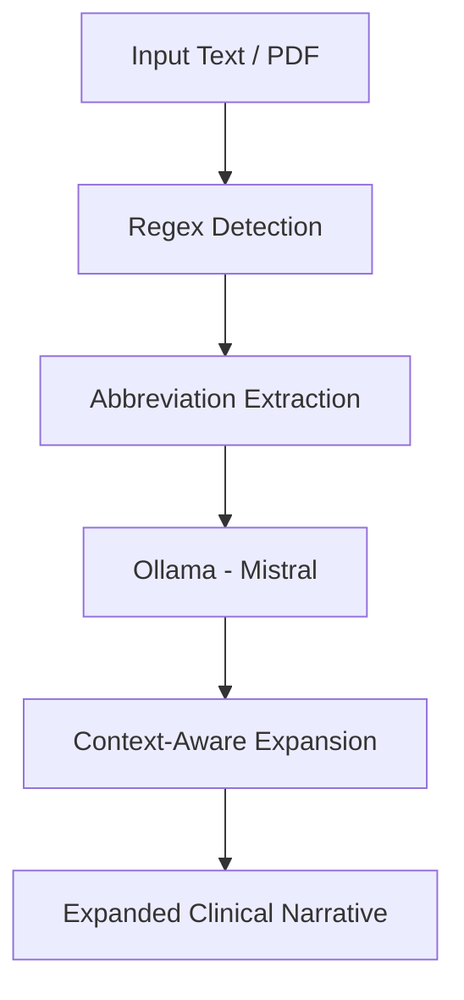
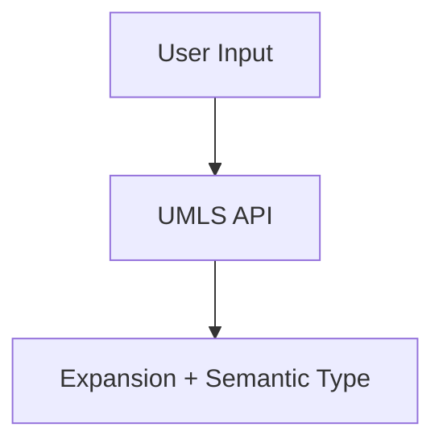

# MedExpander

AI-powered Medical Abbreviation Expansion System using FastAPI, React, Ollama (Mistral), and UMLS.

## Features

* Expand medical abbreviations using context
* PDF clinical note processing
* UMLS integration for medical terminology
* Ollama (Mistral) powered expansion
* FastAPI backend
* React frontend

## Tech Stack

* Frontend: ReactJS
* Backend: FastAPI
* AI Model: Ollama (Mistral)
* PDF Processing: pdfplumber
* Medical Knowledge Base: UMLS API
* Abbreviation Detection: Regex

## Backend Setup

```bash
cd backend

python -m venv venv

# Windows
venv\Scripts\activate

# macOS/Linux
source venv/bin/activate

pip install -r requirements.txt

uvicorn main:app --reload
```

## Ollama Setup

```bash
ollama list

ollama pull mistral

ollama run mistral
```

## Frontend Setup

```bash
cd frontend

npm install

npm run dev
```

## Application URLs

Frontend:
http://localhost:5173

Backend:
http://127.0.0.1:8000/docs

## Example

Input:

Patient has HTN, CKD and CHF.
Patient admitted to ICU due to SOB.

Output:

Patient has Hypertension, Chronic Kidney Disease and Congestive Heart Failure.
Patient admitted to Intensive Care Unit due to Shortness of Breath.

## Project Workflow



## Manual Search



